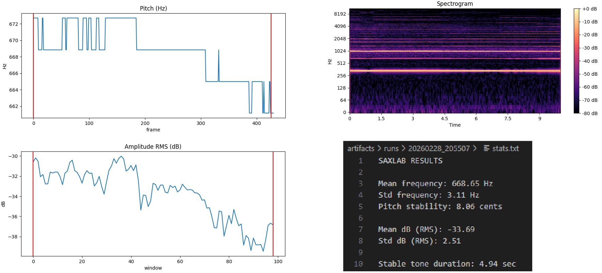

# Trening

Pojedyczny run:
```sh
python3 cli.py --mode single --duration 10
```

Wyświetlane są staty w konsoli + zapis wykresów na dysku.

Trenowanie embouchure:
```sh
python3 cli.py --mode embouchure --duration 5 --interval 3 --repeat 3
```
Naganie trzech 5 sekundowych tonów co 3 sekundy. Wyświetlane są same staty w konsoli i zapis na dysku.



# Architektura

| warstwa  | odpowiedzialność |
| -------- | ---------------- |
| CLI      | wybór trybu      |
| sessions | logika treningu  |
| analysis | analiza sygnału  |
| dsp      | matematyka       |
| audio    | nagrywanie       |
